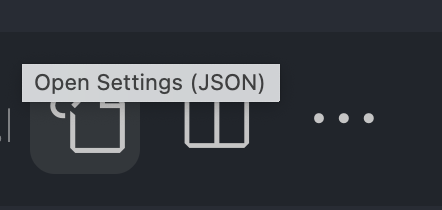

# SASS Syntactically Awesome Style Sheets
CSS on its own can be fun, but as your stylesheets get larger and more complex the harder it is to maintain. This is where a preprocessor can help. SASS gives you additional tools to help you to write and manage your css. SASS compiles to CSS.

__SASS VS SCSS__  
There are two syntaxes available for SASS and SCSS. They are basically the same just written with a different syntax. One use the curly brace the other doesn't.  

1. SCSS (Sassy CSS)  
```scss
  .selector{
   color:tomato;
  }
```

1. SCSS (Sassy CSS)  
```sass
  .selector 
     color:tomato; 
   
```

Everything you need to know about [sass basics](https://sass-lang.com/guide). Please read the documentation on the following topics.  

## What You Need To Learn
1. Nesting
1. Variables
1. Partials
1. Modules
1. Extends/Inheritance
1. Mixins
 
 ## NPM Module
 If your using SASS in a front end development project make sure that you install the sass npm modules.
 ```npm
   npm install -D sass
 ```

## VS Code Extensions
 If your using SASS in side of VS code make sure to install the [Live Sass Compiler plugin.](https://marketplace.visualstudio.com/items?itemName=ritwickdey.live-sass)
 
 You have to configure VS Code and the live sass compiler plugin.
 1. Go to gear icon and select setting from the pop up menu.
 1. In the search settings search for LiveSass  
   
 1. Copy the following code to the settings
 ```json
 "liveSassCompile.settings.formats": [
    {
      "format": "expanded",
      "extensionName": ".css",
      "savePath": "~/../css/"
    }
  ],
 ```  
 1. To run the LiveSass Compiler open the command palette (CTRL+Shift+P) and type the following command. 
 ```
     LiveSass: Watch Sass

 ```

  1. To turn the compiler off open the command palette (CTRL+Shift+P) and type the following command. 
 ```
     LiveSass: Stop Watching

 ```

 ## Variables
 ```scss
  $font-stack: -apple-system, BlinkMacSystemFont, "Segoe UI", Roboto,
     "Helvetica Neue", Arial, "Noto Sans", sans-serif, "Apple Color Emoji",
     "Segoe UI Emoji", "Segoe UI Symbol", "Noto Color Emoji"  ;
  $primary-color: #333333;
  $box-shadow: 0 0 3px 1px grey;

  body {
    font-family: $font-stack;
    color: $primary-color;
    box-shadow: $ $box-shadow;
}
 ```
## Nesting
```scss
.app-bar {
   padding: 1rem;
  ul {
    display:flex;
    justify-content:space-between;
    align-items:center;
  }

  li { 
    border-bottom: 1px solid grey;
    margin-bottom: 1.5rem;
     }
}
```

## Partials
You can create partial Sass files that contain little snippets of CSS that you can include in other Sass files. This is a great way to modularize your CSS and help keep things easier to maintain.  
  
A partial is a Sass file named with a leading underscore. You might name it something like _app-bar.scss.  
  
The underscore lets Sass know that the file is only a partial file and that it should not be generated into a CSS file.  
  
Sass partials are used with the @use rule.

 